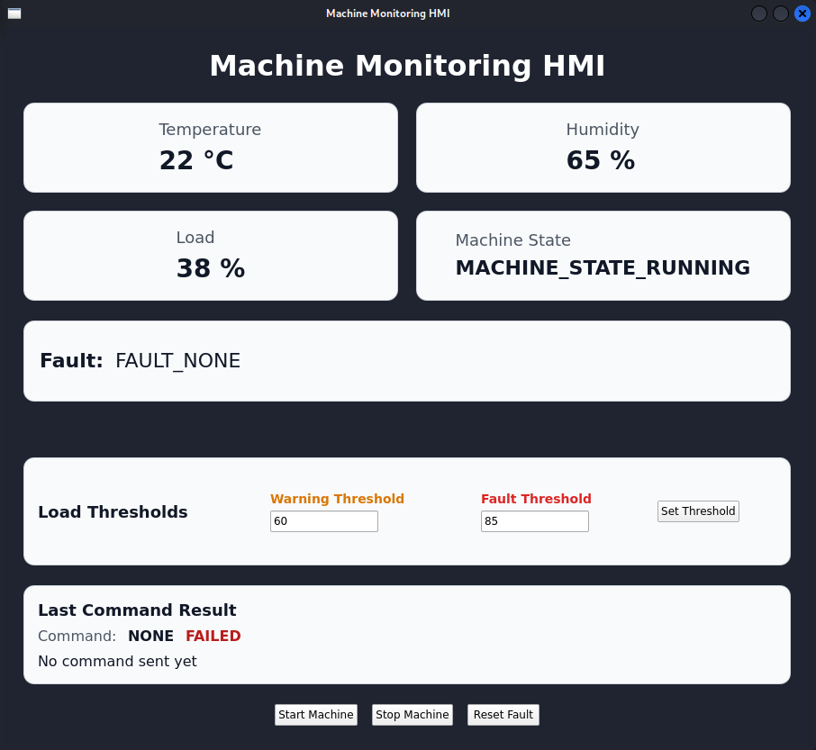

# Machine Monitoring HMI

A Qt/QML Human-Machine Interface for an embedded machine monitoring system.

This application runs inside a ROS2 Jazzy Docker development environment and communicates with a Raspberry Pi 5 Yocto-based gateway over ROS2. The Raspberry Pi forwards commands and telemetry between the HMI and an STM32 firmware node through ROS2, Unix socket IPC, and UART.

## Project Goal

The goal of this project is to build a practical embedded HMI that demonstrates real system integration between:

* Qt/QML frontend
* C++ backend
* ROS2 communication
* Raspberry Pi 5 running Yocto Linux
* STM32 firmware
* UART communication
* Systemd services
* Real machine telemetry and control commands

This project is part of a larger embedded Linux and STM32 machine monitoring platform.

## Screenshot



## System Architecture

```text
Qt/QML HMI
    |
    | ROS2 over Ethernet
    v
Raspberry Pi 5 Yocto Gateway
    |
    | ROS2 bridge
    v
ros2-stm32-bridge
    |
    | Unix socket IPC
    v
edge-gateway
    |
    | UART
    v
STM32 firmware
```

## Features

* Live telemetry display from ROS2
* Temperature monitoring
* Humidity monitoring
* Load monitoring
* Machine state display
* Fault state display
* Start machine command
* Stop machine command
* Reset fault command
* Set load warning threshold
* Set load fault threshold
* Command result feedback inside the GUI
* Docker-based development environment
* Qt/QML frontend with C++ backend
* ROS2 Jazzy communication over Ethernet

## Current HMI Functions

The HMI can display real telemetry from:

```text
/machine/telemetry
```

It can call these ROS2 services:

```text
/machine/start_machine
/machine/stop_machine
/machine/reset_fault
/machine/set_load_threshold
```

## ROS2 Interfaces

### Telemetry Topic

```text
/machine/telemetry
```

Message type:

```text
machine_interfaces/msg/MachineTelemetry
```

Example fields:

```text
temperature
humidity
load
state
fault
operating_mode
dht_status
load_status
```

### Command Services

```text
/machine/start_machine
/machine/stop_machine
/machine/reset_fault
```

Service type:

```text
std_srvs/srv/Trigger
```

### Load Threshold Service

```text
/machine/set_load_threshold
```

Service type:

```text
machine_interfaces/srv/SetLoadThreshold
```

Example request:

```text
warning: 60
fault: 85
```

## Repository Structure

```text
machine-monitoring-hmi/
├── CMakeLists.txt
├── Dockerfile
├── docker-compose.yml
├── include/
│   ├── TelemetryModel.hpp
│   ├── Ros2TelemetryClient.hpp
│   └── Ros2CommandClient.hpp
├── src/
│   ├── main.cpp
│   ├── TelemetryModel.cpp
│   ├── Ros2TelemetryClient.cpp
│   └── Ros2CommandClient.cpp
├── qml/
│   └── Main.qml
└── README.md
```

## Main Components

### QML Frontend

The QML frontend defines the graphical user interface.

It displays:

* Temperature
* Humidity
* Load
* Machine state
* Fault state
* Last command result
* Load threshold inputs
* Control buttons

Main file:

```text
qml/Main.qml
```

### TelemetryModel

`TelemetryModel` is the Qt data model exposed to QML.

It stores the current values shown in the GUI:

* `temperature`
* `humidity`
* `load`
* `state`
* `fault`
* `lastCommandName`
* `lastCommandSuccess`
* `lastCommandMessage`

It also exposes functions called from QML:

```cpp
startMachine()
stopMachine()
resetFault()
setLoadThreshold(int warning, int fault)
```

### Ros2TelemetryClient

`Ros2TelemetryClient` handles ROS2 telemetry subscription.

It subscribes to:

```text
/machine/telemetry
```

When new telemetry arrives, it emits a Qt signal:

```cpp
telemetryReceived(...)
```

That signal updates `TelemetryModel`.

### Ros2CommandClient

`Ros2CommandClient` handles ROS2 service calls.

It calls:

```text
/machine/start_machine
/machine/stop_machine
/machine/reset_fault
/machine/set_load_threshold
```

When a service response arrives, it emits:

```cpp
commandResult(...)
```

That result is displayed in the GUI.

## Development Environment

This project is developed inside Docker using:

* ROS2 Jazzy
* Qt6
* QML
* CMake
* Colcon

The Docker container uses host networking so ROS2 can communicate with the Raspberry Pi over Ethernet.

## Network Setup

The current direct Ethernet setup is:

```text
Host PC:      192.168.50.1
Raspberry Pi: 192.168.50.2
```

ROS2 settings:

```text
ROS_DOMAIN_ID=7
ROS_LOCALHOST_ONLY=0
```

## Build and Run

### 1. Allow Docker to open GUI windows

Run on the host PC:

```bash
xhost +local:root
```

### 2. Start the Docker container

```bash
docker compose run --rm hmi-dev
```

### 3. Source ROS2 and custom interfaces

Inside Docker:

```bash
source /opt/ros/jazzy/setup.sh
source /hmi/ros_ws/install/setup.sh
```

### 4. Build the HMI

```bash
cd /hmi

rm -rf build-docker
cmake -S . -B build-docker
cmake --build build-docker -j$(nproc)
```

### 5. Run the HMI

```bash
./build-docker/machine_monitoring_hmi
```

## Test ROS2 Communication

Before running the GUI, check that the Raspberry Pi ROS2 node is visible:

```bash
ros2 node list
```

Expected:

```text
/stm32_bridge_node
```

Check available topics:

```bash
ros2 topic list
```

Expected:

```text
/machine/telemetry
```

Check available services:

```bash
ros2 service list
```

Expected:

```text
/machine/start_machine
/machine/stop_machine
/machine/reset_fault
/machine/set_load_threshold
```

Test telemetry:

```bash
ros2 topic echo /machine/telemetry
```

Test a service manually:

```bash
ros2 service call /machine/reset_fault std_srvs/srv/Trigger "{}"
ros2 service call /machine/start_machine std_srvs/srv/Trigger "{}"
```

## Docker Notes

The Docker container needs GUI access through X11.

Important environment variables:

```yaml
DISPLAY: ${DISPLAY}
QT_X11_NO_MITSHM: "1"
QT_QPA_PLATFORM: xcb
QT_QUICK_BACKEND: software
LIBGL_ALWAYS_SOFTWARE: "1"
QT_XCB_GL_INTEGRATION: none
ROS_DOMAIN_ID: "7"
ROS_LOCALHOST_ONLY: "0"
```

These allow:

* Qt windows to appear on the host desktop
* Software rendering inside Docker
* ROS2 communication with the Raspberry Pi

## Current Status

Working features:

* Qt/QML GUI starts successfully inside Docker
* ROS2 discovery works from Docker to Raspberry Pi
* Custom `machine_interfaces` package is built and sourced
* Live telemetry is displayed in the HMI
* Start, stop, and reset fault buttons call real ROS2 services
* Command results are displayed in the GUI
* Load warning and fault thresholds can be configured from the HMI
* Connection status display

## Future Improvements

Planned next steps:

* Show last telemetry update time
* Improve UI layout and styling

## Example End-to-End Flow

When the user clicks `Start Machine`:

```text
QML Button
    |
    v
TelemetryModel::startMachine()
    |
    v
startMachineRequested()
    |
    v
Ros2CommandClient::startMachine()
    |
    v
ROS2 service call /machine/start_machine
    |
    v
Raspberry Pi ROS2 bridge
    |
    v
edge-gateway
    |
    v
UART command to STM32
    |
    v
STM32 starts machine
    |
    v
Response appears in HMI
```
## Related Projects

This HMI is part of a larger machine monitoring system:

```text
machine-monitoring-edge-gateway : https://github.com/anasmansouri/machine-monitoring-edge-gateway
stm32-machine-io-node : https://github.com/anasmansouri/stm32-machine-io-node
machine-monitoring-hmi : https://github.com/anasmansouri/machine-monitoring-hmi 
```
Together, these projects demonstrate an end-to-end embedded monitoring and control system.


