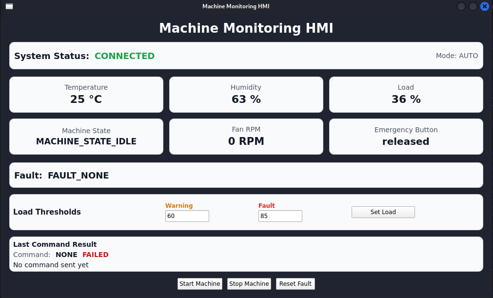

# Machine Monitoring HMI

Qt/QML Human-Machine Interface for an embedded machine monitoring and control system.

The HMI runs in a ROS2 Jazzy Docker development environment on the host PC. It communicates with a Raspberry Pi 5 Yocto-based edge gateway over ROS2. The Raspberry Pi forwards telemetry and commands between the HMI and an STM32 machine I/O node through ROS2, Unix socket IPC, and UART.

## Project Goal

The goal of this project is to demonstrate a practical embedded HMI connected to a real microcontroller and embedded Linux gateway.

It integrates:

* Qt/QML frontend
* C++ backend exposed to QML
* ROS2 Jazzy communication
* Custom ROS2 interfaces
* Raspberry Pi 5 running Yocto Linux
* STM32 firmware over UART
* Real machine telemetry
* Machine control commands
* Load threshold configuration

This project is part of a larger end-to-end embedded monitoring platform.

## Screenshot



## System Architecture

```text
+------------------------------+
| Qt/QML HMI                   |
| - Compact dashboard          |
| - Machine controls           |
| - Load threshold settings    |
| - Command result feedback    |
+---------------+--------------+
                |
                | ROS2 over Ethernet
                v
+---------------+--------------+
| Raspberry Pi 5 Yocto Gateway |
| ros2-stm32-bridge            |
| edge-gateway                 |
+---------------+--------------+
                |
                | UART
                v
+---------------+--------------+
| STM32 Machine I/O Node       |
| Sensors, fan, LEDs, E-stop   |
+------------------------------+
```

End-to-end command example:

```text
QML button
  -> TelemetryModel C++ method
  -> Qt signal
  -> Ros2CommandClient
  -> ROS2 service call
  -> Raspberry Pi bridge
  -> edge-gateway
  -> UART command to STM32
  -> response shown in HMI
```

## Related Repositories

```text
Raspberry Pi / Yocto / ROS2 gateway : https://github.com/anasmansouri/machine-monitoring-edge-gateway
STM32 firmware                      : https://github.com/anasmansouri/stm32-machine-io-node
```

## Current Dashboard

The current compact HMI shows:

* Connection status
* Temperature
* Humidity
* Load
* Machine state
* Fan RPM
* Emergency button state
* Fault state
* Load warning/fault threshold inputs
* Last command result
* Start / Stop / Reset Fault buttons

The vibration card was removed from the current dashboard because the ADXL345 sensor is temporarily disabled in the hardware setup. The backend interface can still keep vibration fields for compatibility with the gateway and ROS2 message.

## Features

* Live telemetry display from ROS2
* Compact one-page QML dashboard
* Connection status indicator
* Temperature monitoring
* Humidity monitoring
* Load monitoring
* Fan RPM monitoring
* Emergency stop state display
* Machine state display
* Fault state display
* Start machine command
* Stop machine command
* Reset fault command
* Load warning/fault threshold configuration
* Command result feedback inside the GUI
* Docker-based development environment
* Qt/QML frontend with C++ backend
* ROS2 Jazzy communication over Ethernet

## ROS2 Interfaces

### Telemetry Topic

```text
/machine/telemetry
```

Message type:

```text
machine_interfaces/msg/MachineTelemetry
```

Full message fields:

```text
int32 temperature
int32 humidity
int32 load
uint32 fan_rpm
int32 vibration_x_mg
int32 vibration_y_mg
int32 vibration_z_mg
int32 vibration_level_mg
bool emergency_button
string state
string fault
string operating_mode
string dht_status
string load_status
```

Current UI-visible fields:

```text
temperature
humidity
load
fan_rpm
emergency_button
state
fault
```

Vibration fields can remain in the ROS2 message as `0` while the physical vibration sensor is disabled.

### Command Services

```text
/machine/start_machine
/machine/stop_machine
/machine/reset_fault
```

Service type:

```text
std_srvs/srv/Trigger
```

### Load Threshold Service

```text
/machine/set_load_threshold
```

Service type:

```text
machine_interfaces/srv/SetThreshold
```

Example request:

```text
warning: 60
fault: 85
```

The backend can also support `/machine/set_vibration_threshold` for future re-enabling of the vibration sensor, but the current compact HMI does not expose this control.

## Repository Structure

```text
machine-monitoring-hmi/
├── CMakeLists.txt
├── Dockerfile
├── docker-compose.yml
├── include/
│   ├── TelemetryModel.hpp
│   ├── Ros2TelemetryClient.hpp
│   └── Ros2CommandClient.hpp
├── src/
│   ├── main.cpp
│   ├── TelemetryModel.cpp
│   ├── Ros2TelemetryClient.cpp
│   └── Ros2CommandClient.cpp
├── qml/
│   └── Main.qml
├── ros_ws/
│   └── src/machine_interfaces/
└── README.md
```

## Main Components

### QML Frontend

Main file:

```text
qml/Main.qml
```

The QML frontend defines the graphical user interface and displays:

* Metric cards
* Machine state and fault status
* Load threshold form
* Command buttons
* Last command feedback
* Connection status

### TelemetryModel

`TelemetryModel` is the Qt data model exposed to QML.

It stores values displayed in the GUI:

```text
temperature
humidity
load
fanRpm
emergency_button
state
fault
connectStatus
lastCommandName
lastCommandSuccess
lastCommandMessage
```

It also exposes QML-callable functions:

```cpp
startMachine()
stopMachine()
resetFault()
setLoadThreshold(int warning, int fault)
```

### Ros2TelemetryClient

`Ros2TelemetryClient` handles ROS2 telemetry subscription.

It subscribes to:

```text
/machine/telemetry
```

When new telemetry arrives, it emits a Qt signal that updates `TelemetryModel`.

### Ros2CommandClient

`Ros2CommandClient` handles ROS2 service calls.

It calls:

```text
/machine/start_machine
/machine/stop_machine
/machine/reset_fault
/machine/set_load_threshold
```

When a service response arrives, it emits a command result signal. The result is displayed in the GUI.

## Development Environment

This project is developed inside Docker using:

* ROS2 Jazzy
* Qt6
* QML
* CMake
* Colcon

The Docker container uses host networking so ROS2 can communicate with the Raspberry Pi over Ethernet.

## Network Setup

Current direct Ethernet setup:

```text
Host PC:      192.168.50.1
Raspberry Pi: 192.168.50.2
ROS_DOMAIN_ID=7
ROS_LOCALHOST_ONLY=0
```

## Build and Run

### 1. Allow Docker to open GUI windows

Run on the host PC:

```bash
xhost +local:root
```

### 2. Start the Docker container

```bash
docker compose run --rm hmi-dev
```

### 3. Build custom ROS2 interfaces

Inside Docker:

```bash
source /opt/ros/jazzy/setup.bash
cd /hmi/ros_ws
rm -rf build install log
colcon build --symlink-install
source install/setup.bash
```

Check interfaces:

```bash
ros2 interface show machine_interfaces/msg/MachineTelemetry
ros2 interface show machine_interfaces/srv/SetThreshold
```

### 4. Build the HMI

```bash
cd /hmi
rm -rf build-docker
cmake -S . -B build-docker
cmake --build build-docker -j$(nproc)
```

### 5. Run the HMI

```bash
./build-docker/machine_monitoring_hmi
```

## Test ROS2 Communication

Before running the GUI, check that the Raspberry Pi ROS2 node is visible:

```bash
ros2 node list
```

Expected:

```text
/stm32_bridge_node
```

Check available topics:

```bash
ros2 topic list
```

Expected:

```text
/machine/telemetry
```

Check telemetry:

```bash
ros2 topic echo /machine/telemetry
```

Check available services:

```bash
ros2 service list
```

Expected services:

```text
/machine/start_machine
/machine/stop_machine
/machine/reset_fault
/machine/set_load_threshold
```

Optional service that may also exist in the gateway:

```text
/machine/set_vibration_threshold
```

Manual service tests:

```bash
ros2 service call /machine/reset_fault std_srvs/srv/Trigger "{}"
ros2 service call /machine/start_machine std_srvs/srv/Trigger "{}"
ros2 service call /machine/stop_machine std_srvs/srv/Trigger "{}"
ros2 service call /machine/set_load_threshold machine_interfaces/srv/SetThreshold "{warning: 60, fault: 85}"
```

## Docker Notes

The Docker container needs GUI access through X11.

Important environment variables:

```yaml
DISPLAY: ${DISPLAY}
QT_X11_NO_MITSHM: "1"
QT_QPA_PLATFORM: xcb
QT_QUICK_BACKEND: software
LIBGL_ALWAYS_SOFTWARE: "1"
QT_XCB_GL_INTEGRATION: none
ROS_DOMAIN_ID: "7"
ROS_LOCALHOST_ONLY: "0"
```

These allow:

* Qt windows to appear on the host desktop
* Software rendering inside Docker
* ROS2 communication with the Raspberry Pi

## Current Status

Working:

* Qt/QML GUI starts successfully inside Docker
* Compact one-page dashboard is implemented
* ROS2 discovery works from Docker to Raspberry Pi
* Custom `machine_interfaces` package builds successfully
* Live telemetry is displayed in the HMI
* Temperature, humidity, load, fan RPM, emergency state, machine state and fault are shown
* Start, stop, and reset fault buttons call real ROS2 services
* Command results are displayed in the GUI
* Load warning and fault thresholds can be configured from the HMI
* Connection status display is available

Current hardware/HMI scope:

```text
Temperature
Humidity
Load
Fan RPM
Emergency stop
Machine state
Fault state
Load threshold configuration
Start / Stop / Reset Fault commands
```

Vibration monitoring is intentionally hidden from the current UI because the ADXL345 sensor is temporarily removed from the hardware setup.

## Future Improvements

* Re-enable vibration dashboard card when the ADXL345 or a replacement sensor is available
* Add last telemetry update timestamp
* Add better visual state colors for warning/fault conditions
* Add a connection lost timeout indicator
* Add a short demo video and updated screenshot
* Package the HMI for easier deployment outside the development container

## Example End-to-End Flow

When the user clicks `Start Machine`:

```text
QML Button
    |
    v
TelemetryModel::startMachine()
    |
    v
startMachineRequested()
    |
    v
Ros2CommandClient::startMachine()
    |
    v
ROS2 service call /machine/start_machine
    |
    v
Raspberry Pi ROS2 bridge
    |
    v
edge-gateway
    |
    v
UART command to STM32
    |
    v
STM32 starts machine
    |
    v
Response appears in HMI
```

## Full Project Chain

```text
STM32 Machine I/O Node
  -> UART
  -> Raspberry Pi 5 Yocto Edge Gateway
  -> Unix socket IPC
  -> ROS2 /machine/telemetry and services
  -> Qt/QML HMI
```

Together, these repositories demonstrate an end-to-end embedded monitoring and control system.
